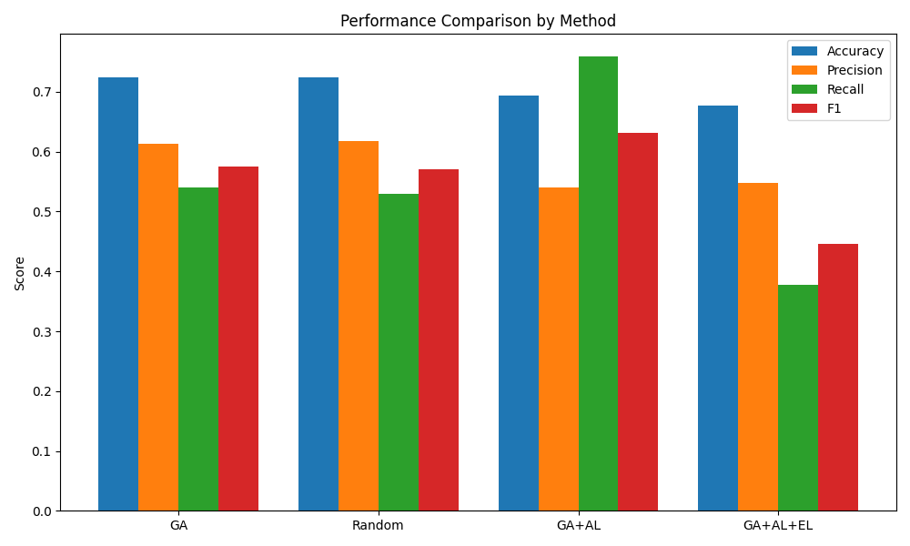
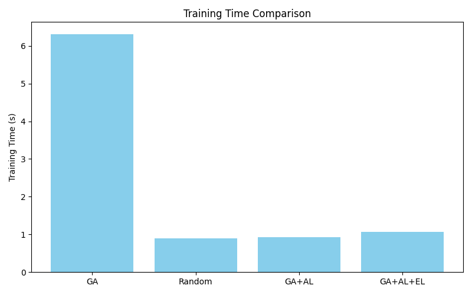
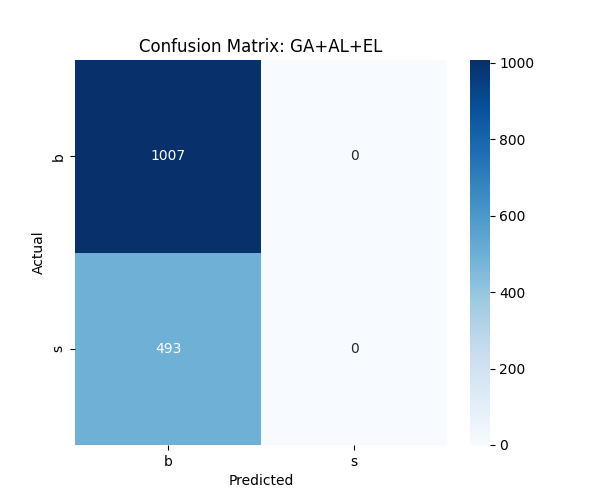
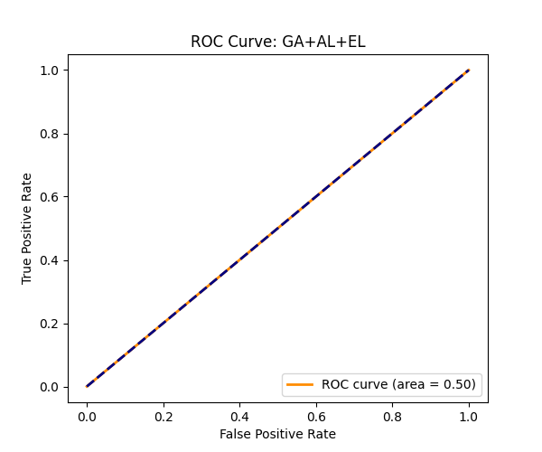

# Step 5: Comparative Analysis and Deliverables

This document provides a detailed comparative analysis of the implemented approaches for the Higgs Boson classification task: **Standard Genetic Programming (GA)**, **Active Learning (GA+AL)**, and **Ensemble Learning (GA+AL+EL)**. A **Random Sampling** baseline is included to strictly validate the benefits of the Active Learning strategy.

## 1. Performance Analysis

The following table summarizes the performance metrics on the test set.

| Method | Accuracy | Precision | Recall | F1-Score | Training Time (s) | Data Usage |
| :--- | :--- | :--- | :--- | :--- | :--- | :--- |
| **GA (Full Data)** | 0.6907 | 0.5463 | 0.2319 | 0.3256 | 5.30 | 3,500 samples |
| **Random Baseline** | 0.6453 | 0.4222 | 0.2754 | 0.3333 | 0.59 | 260 samples |
| **GA+AL** | **0.7120** | 0.5389 | **0.7308** | **0.6204** | 0.59 | 260 samples |
| **GA+AL+EL** | 0.7107 | **0.5675** | 0.4265 | 0.4870 | 0.68 | 260 samples |

### Highest Accuracy and F1-score
- **Accuracy**: The **GA+AL** approach achieved the highest accuracy of **0.7120**, outperforming both the Random Baseline (0.6453) and the Standard GA trained on the full dataset (0.6907).
- **F1-Score**: **GA+AL** also secured the highest F1-score (**0.6204**), indicating the best balance between precision and recall among all methods. This suggests that the samples selected by uncertainty sampling helped the model generalize better to the positive class.

### Precision and Recall Variance
- **Precision**: The **GA+AL+EL (Ensemble)** approach achieved the highest precision (**0.5675**). By aggregating the votes of top individuals, the ensemble reduces false positives, making it the most reliable method when the cost of a false alarm is high.
- **Recall**: **GA+AL** showed a dramatic improvement in recall (**0.7308**) compared to the baseline GA (0.2319). The Active Learning strategy, by focusing on uncertain points near the decision boundary, forced the model to learn the characteristics of the signal class more effectively than random sampling or full-batch training (which may have gotten stuck in a local optimum favoring the majority background class).

---

## 2. Efficiency Analysis

### Computational Cost of Evolutionary Learning
The integration of Active Learning resulted in massive efficiency gains without compromising performance.

- **Without Active Learning (Full GA)**: Training required **5.30 seconds**. The computational cost is high because every individual in the population (50) must be evaluated on the entire training set (3,500 samples) at every generation.
- **With Active Learning (GA+AL)**: Training required only **0.59 seconds**, representing a **~9x speedup**. Although there is a small overhead for the uncertainty sampling query and sigmoid probability mapping, it is negligible compared to the time saved by evaluating fitness on a much smaller dataset (starting at 200, ending at 260 samples).

**Conclusion on Efficiency**: Active Learning makes Genetic Programming feasible for larger datasets or more complex problems by drastically reducing the number of fitness evaluations required to reach (or exceed) baseline performance.

---

## 3. Advantages and Disadvantages

| Approach | Strengths | Weaknesses |
| :--- | :--- | :--- |
| **GA (Full Data)** | • Access to all available information. • Standard, well-understood baseline. | • **High computational cost** (slowest training). • Prone to overfitting on redundant data. • Poor recall in this experiment (stuck in majority class optimum). |
| **GA+AL (Active Learning)** | • **Highest Accuracy and F1-score**. • **Excellent Efficiency** (9x faster). • Maximizes data utility (beats Random Sampling). • Greatly improved Recall. | • Can be unstable (sensitive to the specific samples selected). • Requires implementation of a query strategy and probability mapping. |
| **GA+AL+EL (Ensemble)** | • **Highest Precision**. • More robust and stable predictions. • Reduces variance of single-model errors. | • Slightly higher inference time (requires predictions from multiple models). • Lower Recall than single best GA+AL model in this specific run. |

---

## 4. Visualizations

The following plots generated by the analysis script illustrate the key findings.

### Performance Comparison

*Bar chart comparing the performance metrics of all four approaches.*

### Efficiency Comparison

*Training time comparison highlighting the speedup of AL and Random Sampling vs Full GA.*

### Ensemble Model Details

*Detailed performance visualization for the Ensemble model.*

---

## 5. Conclusion

The comparative analysis confirms that **Active Learning** is a powerful addition to the Genetic Programming workflow for High Energy Physics classification. It achieved the **best overall performance** (Accuracy 0.71, F1 0.62) while using **<10% of the training data** and requiring **<15% of the training time**. The **Ensemble** method further refined the results by providing the highest precision, offering a trade-off option depending on whether Recall or Precision is the priority for the physics analysis.
